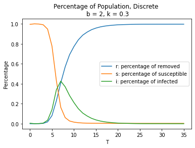
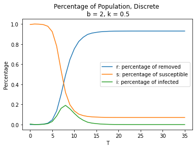
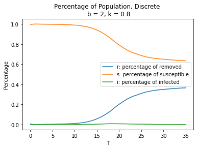
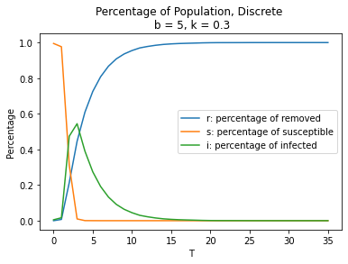
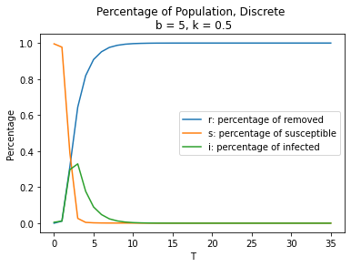
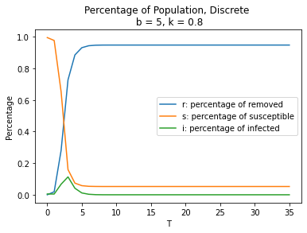
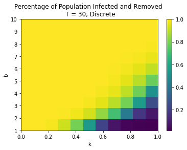
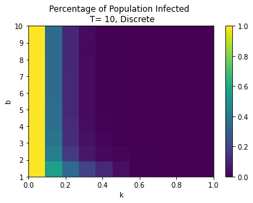
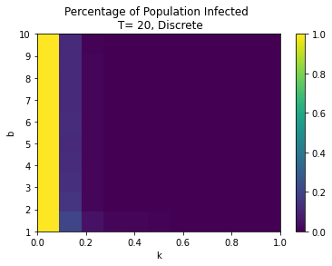
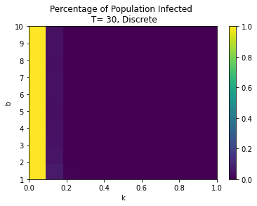

# Preliminary Report

### Introduction to the SIR Model and Notation

The susceptible-infected-removed (SIR) model is built based on the first-order derivative to model the spread of infectious disease, where the time dependent variables $S$, $I$, $R$ each represent the following populations:

$S$(susceptible): number of individuals who are not infected but could become infected

$I$(infected): number of individuals who are already infected and can spread disease

$R$(removed): number of individuals who are either recovered and immune or have died
    
And $s$, $i$, $r$ are used to represent the proportion of susceptible, infected and removed individuals among the population. 

There are two parameters $b$ and $k$ in the model, where $b$ indicates the number of interactions each day that could spread the disease (per individual) and $k$ indicates the fraction of the infectious population which recovers each day. 

In the ODE-based model, we can get the following system of differential equations, where $t$ is time:

$\frac{ds}{dt} = -b * s(t) * i(t)$

$\frac{dr}{dt} = k * i(t)$

$\frac{di}{dt} = b * s(t) * i(t) - k * i(t)$

### Python Package 'sir'

### Discrete Agent-Based Model

To investigate how a new disease spreads, we run the simulations of the discrete agent-based model and the continuous ODE model, starting with 100 infectious individuals out of total population 20000. 

We generate several plots to show how s, i, and r change over the length of the simulation for a couple different choices of k and b. First we check the plots for b = 2, which means we assume each individual has two interactions each day that could spread the disease, with different k values. 

<table><tr>
<td></td>
<td></td>
<td></td>
</tr></table>

From the plots, we find that when the recovery rate is low (0.3), finally all people are removed, which indicates that all people were infectious and either have recovered and are now immune, or have died. As the recovery rate increases to a high value (0.8), the trends change obviously. The percentage of infected people does not increase, and the percentage of removed people increases to approximately 0.4 while the percentage of susceptible people decreases to 0.6. Finally, both trends of removed and susceptible people stays constant. In this case, there are fairly large proportion of individuals who are never infected. Thus, when the recovery rate k is large enough (larger than 0.6) and b is relatively small (less than 3), then the herd immunity is eventually achieved. The herd immunity occurs when a large portion of a community becomes immune to a disease, making the spread of disease unlikely, so the whole community becomes protected. Next, we increase the value of b and see whether the trends change. 

<table><tr>
<td></td>
<td></td>
<td></td>
</tr></table>

When b = 5, each individual has five interactions each day that could spread the disease. These plots suggest that when each individual get contacts with five infectious people per day, if the recovery rate is 0.3, then finally all people are removed after 20 days; if the recovery rate is 0.5, all people are removed after 10 days; even if the recovery rate is 0.8, less than 10% of individuals will remain susceptible after 10 days. As a result, when b is large enough, no matter how large k is, almost all people will be removed eventually, which means that all people will be infected and left with different results. Hence, people should avoid contacting in person with infectious people. Some suggestions include staying at home as much as possible and avoiding visiting areas where the disease is prevalent. 

Now, we want to investigate some qualitative behaviors of the simulations based on the parameters b and k in the phase diagrams. 
The simulations are done with T values 10, 20 and 30 days for both discrete and continuous cases. 

<table><tr>
<td></td>
<td></td>
<td></td>
</tr></table>

The above three phase diagrams illustrate the percentage of population infected and removed, i.e., the total percentage of population infected. It depends on both b, the number of interactions per day per individual that could spread the disease, and k, the recovery rate. The diagrams look very similar for different lengths of simulation (10, 20, and 30 days). It is clear that as k increases and b decreases, the total percentage of population infected decreases. If each individual only has less than two interactions per day that could spread the disease and the recovery rate is higher than 0.6, then almost nobody will be infected over time. The yellow area represents that everyone is eventually infected. When k is less or equal to 0.2, then everyone is eventually infected. Also, when b is larger than 6, everyone is eventually infected. Furthermore, when b is relatively small (less than 7) but k is relatively large (larger than 0.3), everyone is eventually infected. More precisely, the cut edge between the area where all individuals are infected and the remaining area is approximately linear, so that we may estimate the edge by $b = 10k - 3$. Therefore, when $b - 10k + 3 > 0$, everyone is eventually infected. 

<table><tr>
<td></td>
<td></td>
<td></td>
</tr></table>

Then, we try to discover the parameter regimes that i will quickly go to 0. The phase diagrams for only infected population show that the percentage of infected people will quickly goes to 0, if the recovery rate k is large. Specifically, our simulations demonstrate when k is larger than 0.3, i will quickly go to 0 regardless of b. 

### Continuous/ODE-Based Model

The total percentage of the population infected at some point in the simulation depend on these parameters? 
Are there parameter regimes where everyone is eventually infected?

Are there parameter regimes where i quickly goes to 0? 

According to the phase diagrams produced, the following conclusions can be reached:

### Variations and Improvements

